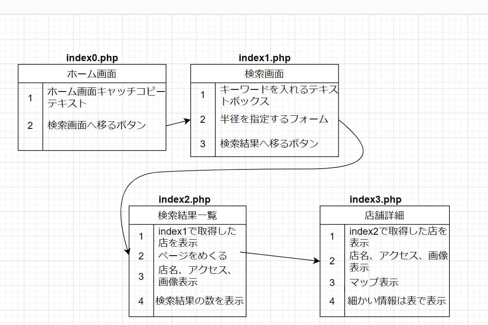

# 簡易仕様書

### 作者
西村彩希

### アプリ名
レストランサーチ

#### コンセプト
現在地付近のお店情報から、行きたいお店を見つけることができる。

#### こだわったポイント
レストランの細かい情報を見ることができるようにしました。

#### デザイン面でこだわったポイント
画像表示の仕方を画面に合わせて変え、見やすいようにしました。

### 該当プロジェクトのリポジトリ URL（GitHub,GitLab など Git ホスティングサービスを利用されている場合）
https://github.com/eboshidori-pen/Selection_Web-App/blob/main/index0.php  
https://github.com/eboshidori-pen/Selection_Web-App/blob/main/index1.php  
https://github.com/eboshidori-pen/Selection_Web-App/blob/main/index2.php  
https://github.com/eboshidori-pen/Selection_Web-App/blob/main/index3.php  
https://github.com/eboshidori-pen/Selection_Web-App/blob/main/CSS/style.css  

## 開発環境
### 開発環境
Visual Studio Code

### 開発言語
PHP

## 動作対象端末・OS
### 動作対象OS
Windows 11  
Google chrome

## 開発期間
9日間

## アプリケーション機能

### 機能一覧
- レストラン検索：ホットペッパーグルメサーチAPIを使用して、現在地周辺の飲食店を検索する。
- キーワード検索：ホットペッパーグルメサーチAPIを使用して、現在地周辺かつキーワードが含まれている飲食店を検索する。
- レストラン情報取得：ホットペッパーグルメサーチAPIを使用して、飲食店の詳細情報を取得する。
- 地図アプリ連携：飲食店の所在地をGoogleマップと連携して表示する。

### 画面一覧
- ホーム画面 ：検索画面に移動するためのボタンを表示する。
- 検索画面 ：条件を指定してレストランを検索する。
- 一覧画面 ：検索結果の飲食店を一覧表示する。
- 詳細情報画面 ：選択したの飲食店を詳細情報を表示する。

### 設計図

### 実装ができなかったこと
- 検索結果数：当てはまった検索結果の数を表示する。
- 詳細情報画面の見出し位置：詳細情報画面の見出し位置を統一させる。

### 使用しているAPI,SDK,ライブラリなど
- GeolocationAPI
- ホットペッパーグルメサーチAPI
- Googleマップ

### アドバイスして欲しいポイント
レストラン詳細のページについて、情報がすぐに分かりにくいと感じたため、アドバイスをしてほしいです。
